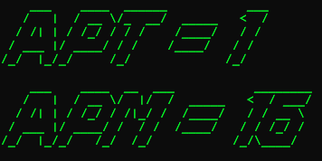

CodeCraft
=========

Based on Electronut's work with arduino and matplotlib, but focusing on making programming feel more like rts.


What it looks like:



### Installation

How to run it:

```bash
make
sudo ./eventlog &
sudo python APM.py starwars
```


ToDo:
-----


1. APM box on the top-right of the screen
  - This is a must, all rts players try to keep their Actions-Per-Minute as high as possible
2. BioStats
  - Heart Rate Monitor on top right (requires Arduino)
3. CPM - Why not? basically this would give an indication of how often one commits to github or the like.
  - Would need to use the github API
  - Could also get useful stats for which languages
4. Results screen
  - Just an idea, instead of a finishing screen at the end of a day's work getting  a screen with:
    - projects contributed
    - code contributed in
    - lines of code written, deleted, modified


